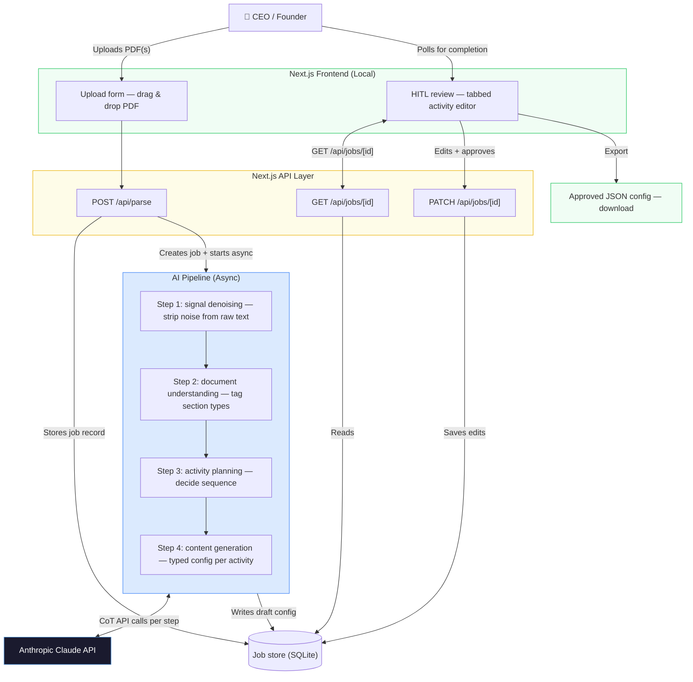

# Project Proposal: AI Onboarding Parser Agent for Replay

## 1. Problem Statement

Replay's onboarding process is a significant operational bottleneck and a barrier to market expansion. Currently, the process is entirely founder-led and manual, requiring the CEO to spend 5 hours per client to extract conversational skills, objection logic, and scoring rubrics from raw training materials. While the technical "Deep Build" of simulations takes 20–30 minutes, the surrounding administrative coordination stretches the total cycle to 5 hours.

**Financial & Operational Impact:**

- **Cost per Onboarding:** $500 (5 hours @ $100/hr internal rate).
- **Annual Overhead:** $125,000 (projected at 250 deals).
- **Capacity Cap:** Currently limited to ~60 deals/year based on last month's volume.
- **Scalability Friction:** Reaching the 250-deal goal requires 1,250 hours of founder labor, over 60% of a work year, creating an unsustainable growth ceiling.

**Market Opportunity Cost:** The high manual setup cost makes smaller $5k–$10k ACV customers economically unattractive. This effectively caps Replay's growth in the SMB segment, as founder-level labor is too expensive for low-margin deal support.

---

## 2. Proposed AI Solution Design

The proposed solution is an **AI Onboarding Parser Agent** integrated into Replay's existing Next.js/React architecture. This agent will automate the "translation" of unstructured client data (PDFs/Scripts) into structured, Replay-ready JSON configurations.

### Technical Workflow (The Ingestion Pipeline)

The agent uses Chain-of-Thought (CoT) prompting to process documents in four sequential steps:

1. **Signal Denoising:** Strips non-conversational noise (schedules, org charts, legal text) so the AI only reasons over relevant training content.
2. **Document Understanding:** Tags filtered content into typed sections (scripts, objection lists, value props, personas).
3. **Activity Planning:** Decides which training activity types to build and in what sequence.
4. **Content Generation:** Produces fully-typed config objects for each planned activity.



**Figure 1:** Full system architecture — local Next.js app with async AI pipeline and HITL review dashboard

### Human-in-the-Loop (HITL) Validation

To preserve deep customization, the CEO reviews AI drafts via a custom dashboard to "fill the gaps" in training nuance.

- **Build Time:** Drops from ~30 minutes to 30 seconds.
- **Total Onboarding Cycle:** Reduced from 5 hours to ~1.5 hours (including meetings).

---

## 3. Roadmap (phased — not strictly timeboxed)

Work is grouped into **phases** with clear exit criteria. Duration flexes with your schedule; order matters more than calendar weeks.

### Phase 1: Prototype — extraction & pipeline

- **Focus:** Core extraction engine and end-to-end AI pipeline.
- **Deliverables:** PDF ingestion; four-step pipeline (denoise → understand → plan → generate); job API + basic upload UI.
- **Exit signal:** Draft config from a real fixture PDF in under ~30 seconds.

### Phase 2: HITL, persistence, export

- **Focus:** Review workflow and production-ish polish.
- **Deliverables:** Review & approve dashboard; SQLite (or equivalent) persistence; JSON export; progress UI.
- **Exit signal:** ~90% of draft content usable before deep edits *(founder-judged; golden checklist TBD)*.

*Detailed tasks and optional later work: [roadmap.md](./roadmap.md).*

---

## 4. Estimated ROI & Financial Analysis


| Performance Metric          | Manual Process (Current) | AI Parser Agent (Proposed)  |
| --------------------------- | ------------------------ | --------------------------- |
| Onboarding Time             | 5 Hours                  | ~1.5 Hours (incl. meetings) |
| Technical "Build" Time      | ~20–30 Minutes           | ~30 Seconds                 |
| Founder Labor Cost Per Deal | $500 (@ $100/Hr)         | ~$150 (@ $100/Hr)           |
| Annual Operations Cost      | $125,000                 | $3,750                      |
| Annual Capacity             | ~60 Deals (Capped)       | 250+ Deals (Scale Ready)    |


**Strategic Impact:**

- **Direct Cost Savings:** Reduces onboarding overhead by $350 per client, saving $87,500 annually at the 250-deal target.
- **Market Expansion:** Lowering the setup cost "floor" allows Replay to profitably target the $5k–$10k ACV segment.
- **Revenue Potential:** Scaling to 250 deals annually represents $1.25M–$2.5M in new ARR, a goal previously unattainable due to founder-led bottlenecks.

---

## 5. Operational Cost Estimate

Because the application runs **locally** (no cloud infrastructure), the only ongoing cost is Claude API usage per onboarding run.

### Per-Document API Cost Breakdown

The pipeline makes four sequential API calls per document. Token estimates are based on a representative 25–30 page training PDF (~15,000 tokens of raw extracted text).

| Pipeline Step | Est. Input Tokens | Est. Output Tokens | Cost (Input @ $3/MTok) | Cost (Output @ $15/MTok) |
| --- | --- | --- | --- | --- |
| Step 1 · Signal Denoising | ~15,000 | ~8,000 | $0.045 | $0.120 |
| Step 2 · Document Understanding | ~8,000 | ~3,000 | $0.024 | $0.045 |
| Step 3 · Activity Planning | ~3,000 | ~1,500 | $0.009 | $0.023 |
| Step 4 · Content Generation (×7 activities) | ~14,000 | ~14,000 | $0.042 | $0.210 |
| **Total per document** | **~40,000** | **~26,500** | **$0.12** | **$0.40** |

**Estimated total cost per document: ~$0.52**

### Per-Onboarding & Annual Projections

| Scenario | Documents | API Cost | Infrastructure Cost | Total |
| --- | --- | --- | --- | --- |
| Single onboarding (avg. 2 docs) | 2 | ~$1.04 | $0 (local) | **~$1.04** |
| 60 deals/year (current capacity) | 120 | ~$62 | $0 | **~$62/yr** |
| 250 deals/year (target capacity) | 500 | ~$260 | $0 | **~$260/yr** |

### Cost Summary

- **Infrastructure:** $0 — the app runs locally on the founder's machine; no AWS, no cloud hosting, no database server required.
- **AI API:** ~$1 per onboarding run. At 250 deals/year, annual API spend is approximately **$260** — less than 0.3% of the $87,500 in annual labor savings.
- **Anthropic API Key:** Pay-as-you-go, no subscription required.

> The cost floor for this tool is effectively the price of an API key. Even at 10× the estimated token usage, annual costs remain under $3,000 — still an order of magnitude below the savings delivered.

---

## 6. User Personas

### Persona 1 — The Founder (Primary User)

| Attribute | Detail |
| --- | --- |
| **Role** | CEO / Founder of Replay |
| **Technical Level** | Moderate — comfortable with software tools, not a developer |
| **Primary Goal** | Onboard new clients faster without sacrificing the quality of the training simulations he builds |
| **Current Pain** | Spends 4+ hours manually reading client PDFs, extracting objections, writing scripts, and structuring scoring rubrics before the actual build can begin |
| **Motivation** | Scale to 250+ deals/year without hiring; reclaim founder time for sales and product |
| **Key Behaviors** | Uploads 1–3 PDFs per client; reviews AI output critically; edits specific fields rather than redoing from scratch; approves and exports when satisfied |
| **Tolerance for Error** | Low — the output directly configures client-facing training. Errors must be catchable before export. |

---

### Persona 2 — The Operations Hire (Secondary / Future User)

| Attribute | Detail |
| --- | --- |
| **Role** | Onboarding Specialist or Ops Manager (future hire as Replay scales) |
| **Technical Level** | Low to moderate — follows documented processes, not a developer |
| **Primary Goal** | Run onboarding jobs on behalf of the founder without requiring founder involvement at every step |
| **Current Pain** | Does not yet exist — this role is created by the tool. Today the founder handles everything. |
| **Motivation** | Execute a clear, repeatable process with low risk of making a mistake |
| **Key Behaviors** | Uploads documents, monitors pipeline progress, flags activities for founder review rather than approving independently |
| **Tolerance for Error** | Higher — expected to escalate ambiguous outputs to the founder rather than approve them |

---

## 7. User Stories

Stories are written from the perspective of each persona and map directly to features in the phased roadmap.

### Founder Stories

| ID | Story | Phase |
| --- | --- | --- |
| US-01 | As the founder, I want to upload one or more client training PDFs so that the system extracts the training content without me reading it manually. | 1 |
| US-02 | As the founder, I want to see real-time pipeline progress (Denoising → Understanding → Planning → Generating) so that I know when the draft is ready and can trust the system is working. | 1 |
| US-03 | As the founder, I want to review the AI-generated learning flow in a structured dashboard so that I can verify the output before it becomes a client deliverable. | 2 |
| US-04 | As the founder, I want to edit any activity's content inline (scripts, objections, scorecards) so that I can correct AI errors without re-running the full pipeline. | 2 |
| US-05 | As the founder, I want to approve individual activities and then export the finalized config as JSON so that I can import it directly into Replay's simulation builder. | 2 |
| US-06 | As the founder, I want low-confidence sections visually flagged so that I know exactly where to focus my 30-second review. | 2 |
| US-07 | As the founder, I want to regenerate a single activity without restarting the pipeline so that I can fix one bad output without losing the rest. | 2 |

### Operations Hire Stories

| ID | Story | Phase |
| --- | --- | --- |
| US-08 | As an ops manager, I want to see a list of all past onboarding jobs with their status so that I can track which clients have been processed and which are in progress. | 2 |
| US-09 | As an ops manager, I want to flag activities for founder review rather than approving them myself so that the founder retains final authority on client-facing output. | 2 |

---

## 8. System Lifecycle Management

### Job State Machine

Each uploaded document set creates a **Parse Job** that moves through defined states from creation to archival.

```
QUEUED → DENOISING → UNDERSTANDING → PLANNING → GENERATING → REVIEW → APPROVED → EXPORTED
                                                                  ↑
                                                            (edits loop here)
```

| State | Description | Who Triggers |
| --- | --- | --- |
| `queued` | Job created, pipeline not yet started | System (on upload) |
| `denoising` | Step 1 running — stripping noise from raw PDF text | System (async) |
| `understanding` | Step 2 running — tagging content into section types | System (async) |
| `planning` | Step 3 running — deciding activity sequence | System (async) |
| `generating` | Step 4 running — building activity configs | System (async) |
| `review` | Draft complete, awaiting human review | System (on pipeline completion) |
| `approved` | All activities approved by the founder | Founder |
| `exported` | Config downloaded as JSON | Founder |

### Data Retention

- **Storage:** All jobs are persisted in a local SQLite database. Jobs survive server restarts.
- **Draft edits:** Each `PATCH` to a job saves the updated config non-destructively. Prior states are not auto-deleted.
- **Approved configs:** Stored alongside the draft. Both are available for re-export at any time.
- **Archival:** No auto-deletion policy. Jobs remain accessible in the dashboard indefinitely for reference or re-export.

### Error Handling & Recovery

| Failure Point | Behavior |
| --- | --- |
| PDF extraction fails (corrupt / image-only) | Job moves to `error` state with the failed step noted. User is prompted to upload a different file. |
| Claude API timeout or rate limit | Step retries up to 3 times with exponential backoff before marking the step as failed. |
| Partial pipeline failure | Job records which step failed. Completed steps are preserved; only the failed step is retried. |
| Server restart mid-pipeline | Job status reverts to the last completed step checkpoint. User can re-trigger from the dashboard. |

### Versioning

- Each approved export is stamped with a `generatedAt` ISO timestamp and a schema `version` field in the config metadata.
- If a job is re-run after edits, the new export does not overwrite the old file — the founder downloads each export explicitly.

---

## Appendix A: Math at a Glance


| Data Point          | Value        | Calculation / Logic                             |
| ------------------- | ------------ | ----------------------------------------------- |
| Current Labor Cost  | $500/client  | 5 Hours × $100/hr internal rate                 |
| Annual Manual Cost  | $125,000     | 250 Target Deals × $500 current cost            |
| Current Capacity    | ~60 Deals/yr | 5 deals/month (Current) × 12 months             |
| Manual Workload     | 1,250 Hours  | 250 Deals × 5 hours/deal (62.5% of work year)   |
| Proposed Labor Cost | $150/client  | 1.5 Hours × $100/hr internal rate               |
| Proposed Workload   | 375 Hours    | 250 Deals × 1.5 hours/deal (18.7% of work year) |
| Annual Savings      | $87,500      | ($500 - $150) × 250 deals                       |
| New ARR Potential   | $1.25M–$2.5M | 250 Deals × $5k–$10k ACV                        |


---

## Appendix B: Limitations & Risk Mitigation

To ensure technical feasibility, the following risks have been identified with corresponding mitigation strategies.

### 1. LLM "Hallucinations" & Nuance Gaps

- **Risk:** The AI may misinterpret industry-specific jargon or fail to "fill the gaps" in training logic as well as the founder.
- **Mitigation:** The Human-in-the-Loop (HITL) Dashboard is a mandatory step in the workflow. The AI produces a draft, but the founder retains final authority, spending 30 seconds to validate or refine the nuances.

### 2. Data Privacy & PDF Sensitivity

- **Risk:** Processing client training materials (PDFs) requires high security standards.
- **Mitigation:** The system uses Signal Denoising to ignore non-essential data like schedules or financial tables. Furthermore, integration into the existing Next.js/React architecture allows for the use of secure API providers with SOC2 compliance.

### 3. Integration Complexity

- **Risk:** Technical debt or API failures within the existing Replay stack.
- **Mitigation:** The phased roadmap is designed for incremental deployment. Phase 1 is a standalone prototype (extraction + pipeline) before HITL and persistence work in Phase 2.

---

## Notes from Professor

**Items addressed in this revision:**

- ~~**Cost estimates:**~~ → See Section 5: Operational Cost Estimate (~$1/onboarding, ~$260/yr at scale, $0 infrastructure).
- ~~**Data security:**~~ → Not a concern for this deployment. The app runs locally; no data leaves the founder's machine except via the Anthropic API, which is SOC 2 compliant. The CEO and client businesses have accepted this model.
- ~~**Architecture diagram:**~~ → See Figure 1 (Section 2) — full system architecture diagram.
- ~~**User stories:**~~ → See Section 7.
- ~~**User personas:**~~ → See Section 6.
- ~~**Lifecycle management:**~~ → See Section 8.

